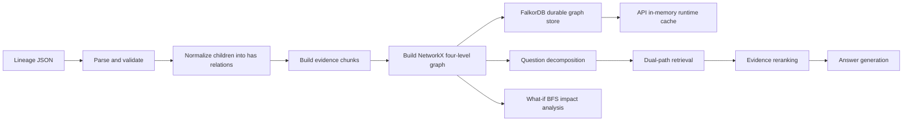

# lineage-graphrag

Lineage GraphRAG is a deterministic GraphRAG engine for data lineage JSON. It turns structured lineage payloads into a four-level graph, retrieves evidence through graph-aware dual-path retrieval, and answers lineage or what-if impact questions with traceable evidence.

This project is not a generic "upload documents and extract a graph with an LLM" system. The graph is built deterministically from lineage JSON; LLMs are optional and are used for question decomposition, answer generation, and iterative retrieval in agent mode.

## What It Does

- Imports lineage JSON with entities, children, and transitions.
- Normalizes `children` into explicit `has` relationships.
- Keeps business entity relations constrained to a small fixed vocabulary.
- Builds a four-level graph: `attribute`, `entity`, `keyword`, and `community`.
- Stores evidence chunks for entities, transitions, and subgraphs.
- Retrieves through two graph-aware paths:
  - Path 1: entity node + relation retrieval.
  - Path 2: triple + community retrieval.
- Supports `agent` and `noagent` query modes.
- Supports what-if downstream impact analysis.
- Persists graphs to FalkorDB when enabled; the API keeps an in-memory runtime cache loaded from FalkorDB.

## Architecture



More detail:

- [Architecture](docs/architecture.md)
- [API examples](docs/api.md)
- [Configuration](docs/configuration.md)
- [Demo walkthrough](docs/demo.md)
- [Operations](docs/operations.md)
- [Evaluation status](docs/evaluation.md)

## Requirements

- Python `>=3.9`
- Optional: Docker, if you want to run FalkorDB
- Optional: local `sentence-transformers` model cache for `all-MiniLM-L6-v2`

Check your Python version first:

```bash
python --version
```

## Quick Start

```bash
python -m pip install -e ".[dev]"
python main.py --reload
```

The API starts on port `8001` by default:

```text
http://localhost:8001
```

Run tests:

```bash
python -m pytest -q
```

If tests fail during collection, first confirm the interpreter and dependencies match this project environment.

## Run A Demo

The small demo under `data/api_requests/` is useful for a quick API smoke test.

Import the demo graph:

```bash
curl -X POST "http://localhost:8001/v1/graphs/import" \
  -H "Content-Type: application/json" \
  --data @data/api_requests/01_graphs_import.json
```

Ask a lineage question:

```bash
curl -X POST "http://localhost:8001/v1/queries/ask" \
  -H "Content-Type: application/json" \
  --data @data/api_requests/03_queries_ask.json
```

Run what-if impact analysis:

```bash
curl -X POST "http://localhost:8001/v1/impact/what-if" \
  -H "Content-Type: application/json" \
  --data @data/api_requests/04_impact_what_if.json
```

## Financial Risk Example

The `example/` directory contains a compact financial risk-control scenario designed for GraphRAG demonstrations and downstream impact testing.

Files:

- `example/financial_risk_lineage.json`: structured lineage JSON with 30 business entities and 30 controlled business relations.
- `example/financial_risk_lineage.md`: field-by-field explanation of the JSON schema and the example graph.
- `example/financial_risk_input.txt`: natural-language scenario text describing the same compact risk-control graph. This represents the kind of text input a future text-to-lineage pipeline could consume.

The example uses six fixed business relation types between entities:

```text
owns, uses, transfers_to, provides_to, scores, triggers
```

In this schema, `transitions` is the top-level edge-list container. The concrete edge name is the per-edge `relation` value, such as `owns` or `scores`.

Import the financial risk graph:

```bash
curl -X POST "http://localhost:8001/v1/graphs/import" \
  -H "Content-Type: application/json" \
  --data "{\"graph_id\":\"financial_risk_demo\",\"lineage_json\":$(cat example/financial_risk_lineage.json)}"
```

On Windows PowerShell:

```powershell
$body = @{
  graph_id = "financial_risk_demo"
  lineage_json = Get-Content example/financial_risk_lineage.json -Raw | ConvertFrom-Json
} | ConvertTo-Json -Depth 100
Invoke-RestMethod -Method Post -Uri "http://localhost:8001/v1/graphs/import" -ContentType "application/json" -Body $body
```

Ask a question using the text scenario as the natural-language query:

```bash
python -c "import json, urllib.request; q=open('example/financial_risk_input.txt', encoding='utf-8').read(); payload=json.dumps({'graph_id':'financial_risk_demo','question':q,'top_k':8,'mode':'noagent','max_steps':2}).encode('utf-8'); req=urllib.request.Request('http://localhost:8001/v1/queries/ask', data=payload, headers={'Content-Type':'application/json'}); print(urllib.request.urlopen(req).read().decode('utf-8')[:2000])"
```

You can also validate the example locally without starting the API:

```bash
python -c "import json, sys; sys.path.insert(0, 'src'); from lineage_graphrag.ingest.parser import LineageParser; from lineage_graphrag.ingest.normalizer import LineageNormalizer; from lineage_graphrag.graph.kt_builder import LineageKTBuilder; data=json.load(open('example/financial_risk_lineage.json', encoding='utf-8')); normalized=LineageNormalizer().normalize(LineageParser().parse(data)); built=LineageKTBuilder().build(normalized); print({'entities': len(normalized.entities), 'transitions': len(normalized.transitions), 'graph_nodes': built.graph.number_of_nodes(), 'graph_edges': built.graph.number_of_edges()})"
```

## API

- `POST /v1/graphs/import`
- `POST /v1/queries/ask`
- `POST /v1/impact/what-if`
- `GET /v1/graphs/{graph_id}/subgraph`

The import endpoint performs import, normalization, graph construction, and FalkorDB persistence in one request. When FalkorDB is enabled, a failed database write returns `503` and the graph is not treated as successfully imported.

## Query Modes

`POST /v1/queries/ask` supports:

- `agent`: LLM-first decomposition plus optional IRCoT iterative retrieval when an LLM provider is available.
- `noagent`: decomposition, one-pass retrieval, and answer generation without iterative follow-up retrieval.

When the configured LLM provider is unavailable, the system still returns deterministic retrieval summaries from the available evidence.

## Storage Model

At runtime, `GraphRepository` keeps graphs and chunks in memory as a request-time cache. When FalkorDB is enabled, FalkorDB is the durable source of truth.

Startup and manual sync behavior:

1. With FalkorDB enabled, the API loads graph ids, graph topology, and chunks from FalkorDB into memory.
2. With FalkorDB disabled, graphs live only in the current API process memory and are gone after restart.
3. `POST /v1/graphs/sync` reloads the memory cache from FalkorDB.

## Project Layout

```text
src/lineage_graphrag/
  api/          FastAPI application and routes
  ingest/       parser, normalizer, evidence chunk builder
  graph/        four-level graph construction and serialization
  retrieval/    decomposer, dual-path retrieval, IRCoT orchestration
  indexing/     embeddings and FAISS/NumPy index wrapper
  impact/       downstream impact analysis helpers
  llm/          provider client, prompts, answer generator
  storage/      in-memory runtime repository and FalkorDB client
  evaluation/   current smoke-check utilities
```

## Current Status

Production-shaped pieces:

- Deterministic lineage import and validation.
- Four-level graph construction.
- Dual-path retrieval.
- API integration flow.
- FalkorDB startup/manual sync into the runtime cache.

Demo or evolving pieces:

- LLM-backed answer quality depends on configured provider and credentials.
- Evaluation modules are smoke checks, not a full benchmark harness.
- The default local demo path is FalkorDB-backed; running without FalkorDB is an in-memory-only development mode.

